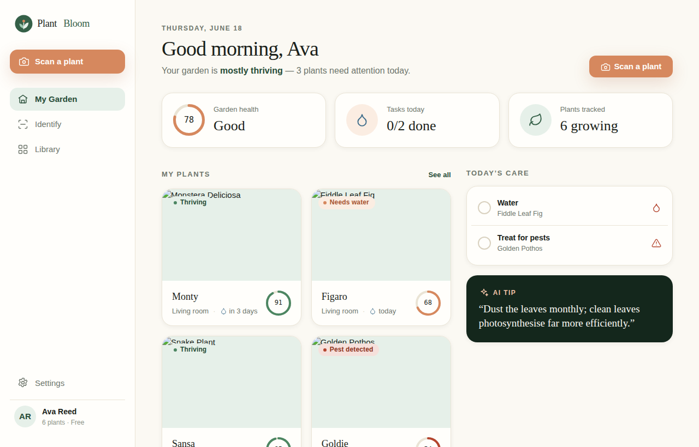

# Plant Bloom 🌱

> **Point, scan, and we'll do the rest.** Plant Bloom is an AI-first plant-care
> web app: photograph any plant, get an instant identification, a health score,
> a plain-language diagnosis, and a personalized care plan — then track your
> whole garden in one calm, editorial-botanical interface.

Built on the **Plant Bloom Design System** (deep canopy greens, a warm
terracotta "bloom" accent, Spectral serif headings, Hanken Grotesk UI).



---

## What it does

It is a **complete, working single-page app** — not a static mockup. Everything
below is real and persisted to your browser's `localStorage`:

- **My Garden** — a dashboard with live garden-health average, today's care
  tasks, and your plants. Check off tasks (watering a plant reschedules its next
  watering and bumps its health; treating pests clears the alert).
- **Identify (AI scan)** — **take a photo with your camera**, **upload an
  image**, or try a sample. Watch the scan animation, then get a diagnosis.
- **Diagnosis result** — identified species, confidence %, health ring,
  findings, and a step-by-step care plan. **Add to my garden** creates a real,
  tracked plant from the result.
- **Library** — every plant you're growing, **searchable** by name/room.
- **Plant detail** — health, next-water timing, light, full care plan;
  **water now**, **rename**, and **remove** actions.
- **Settings** — editable profile name, notification toggles, and **reset demo
  garden** — all persisted.

The app is responsive (the sidebar collapses to a top bar on small screens) and
respects `prefers-reduced-motion`.

> **A note on the "AI":** identification and diagnosis are simulated locally
> against a built-in species catalog (no API key or backend required), so the
> app runs entirely client-side. The scan/diagnosis layer is isolated in one
> function (`diagnose()` in `src/app.jsx`) — swap it for a real vision API
> (e.g. an Anthropic/multimodal endpoint) to make it production-grade.

---

## Run it

It's a static app — **the simplest way is to just open `index.html`** in a
browser. For correct routing and to avoid any `file://` quirks, serving it is
recommended:

```bash
# Option A — the bundled tiny static server (no dependencies)
node server.mjs            # → http://localhost:8080

# Option B — any static server you like
python3 -m http.server 8080
npx serve .
```

An internet connection is used at runtime only for the web fonts (Google Fonts)
and the sample plant photos (Unsplash). React itself is **vendored locally** in
`vendor/`, so the app loads and runs offline aside from those images/fonts.

---

## Develop / rebuild

The UI is written in React (JSX) in **`src/app.jsx`** and **precompiled** to
`app.js` (Babel, classic JSX runtime) so there is no in-browser transpiler —
the page loads fast and works offline.

```bash
npm install      # installs @babel/core + @babel/preset-react (dev only)
npm run build    # compiles src/app.jsx → app.js
npm run dev      # build, then serve on http://localhost:8080
```

After editing `src/app.jsx`, run `npm run build` to regenerate `app.js`.

---

## Project structure

```
index.html        App shell + inlined design-system tokens
src/app.jsx       ← the app source you edit (React)
app.js            ← compiled output (generated by build.mjs; don't edit)
build.mjs         JSX → JS build step
server.mjs        tiny static dev server
vendor/           React + ReactDOM (UMD, vendored for offline use)
assets/           logos (wordmark, mark, reversed)
tokens/           design-system CSS tokens (colors, type, spacing, …)
styles.css        design-system entry point (@imports the tokens)
```

The design tokens are inlined into `index.html` so the app is self-contained;
the `tokens/` + `styles.css` files are kept as the canonical design-system
source for reference and reuse.

---

## Tech

Plain React 18 (no framework), the Plant Bloom design system, and
`localStorage` for persistence. No build server, no bundler config, no backend.
